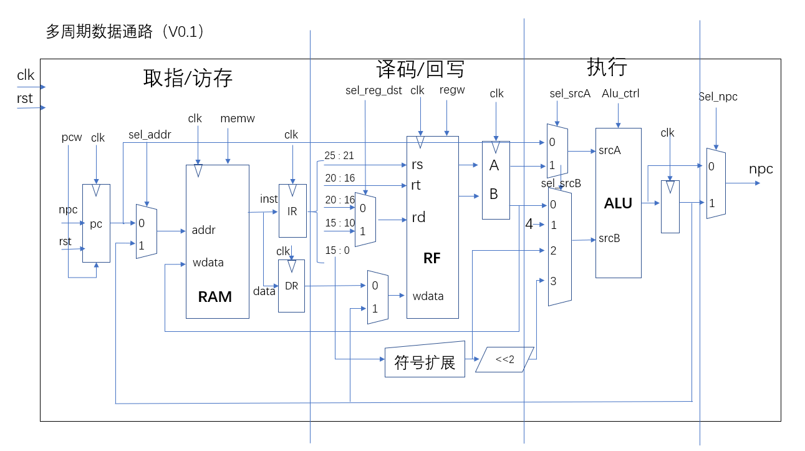

# MIPS 多周期个人设计

> mips 多周期

## 数据通路设计如下：

多周期 lw 指令实现存在的问题：
由于 ram ip 核使用的是 block memory generator，它在读取ram中的数据的时候，数据输出会有两个周期延迟，因此，在 exe3 状态结束后，立即进入 swb2 状态没有卵用，此时ram中的数据还没有读出。解决的话，最简单的可以插入空闲周期。

多周期 beq 指令实现存在问题：
同样由于读取 ram 延迟的问题，在beq跳转之后，pc值更新，但是指令不能立即读出，需要插入空闲周期等待指令读出。

多周期 j 指令实现存在问题：
同上

